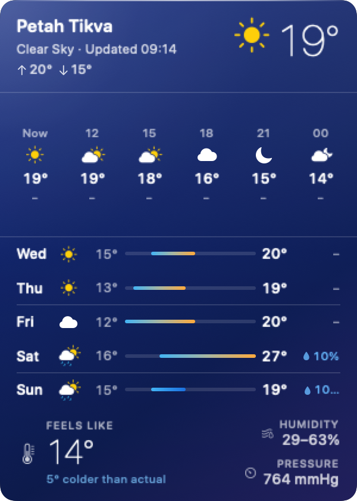

# Weather

macOS menu bar weather app built with `SwiftUI` and `OpenWeather`.



## Release

- Current version: `1.1`
- Latest snapshot tag: `v1.1`
- Changelog: [CHANGELOG.md](/Users/grigorymordokhovich/Documents/Develop/Weather/CHANGELOG.md)

## Setup

1. Copy [Config/Secrets.example.xcconfig](/Users/grigorymordokhovich/Documents/Develop/Weather/Config/Secrets.example.xcconfig) to `Config/Secrets.xcconfig`.
2. Put your OpenWeather API key into `WEATHER_API_KEY`.
3. Generate the Xcode project:

```bash
xcodegen generate
```

4. Open `Weather.xcodeproj` in Xcode and run the `Weather` scheme.

## Build and install

For a stable local app bundle in `/Applications`:

```bash
./scripts/build_and_install_app.sh
```

This flow regenerates the Xcode project when needed, builds the `Release` app with `xcodebuild`, copies it to `dist/Weather.app`, installs it to `/Applications/Weather.app`, and keeps the stable bundle identifier `com.grigorymordokhovich.weather`.

Useful overrides:

```bash
CONFIGURATION=Debug ./scripts/build_and_install_app.sh
DEVELOPER_DIR_OVERRIDE=/Applications/Xcode-beta.app/Contents/Developer ./scripts/build_and_install_app.sh
SIGN_IDENTITY="Apple Development: Your Name (TEAMID)" ./scripts/build_and_install_app.sh
```

## Dev shortcuts

Launch the installed app:

```bash
./scripts/run_app.sh
```

Tail recent logs and continue streaming:

```bash
./scripts/open_logs.sh
```

Optional overrides:

```bash
APP_PATH="/Applications/Weather.app" ./scripts/run_app.sh
LAST_WINDOW=10m STYLE=json ./scripts/open_logs.sh
```

Generate the repository screenshot:

```bash
mkdir -p /tmp/weather-screenshot-build
DEVELOPER_DIR=/Applications/Xcode-beta.app/Contents/Developer xcrun swiftc -parse-as-library -emit-module -emit-object -module-name WeatherCore Sources/WeatherCore/WeatherModels.swift -o /tmp/weather-screenshot-build/WeatherCore.o -emit-module-path /tmp/weather-screenshot-build/WeatherCore.swiftmodule
DEVELOPER_DIR=/Applications/Xcode-beta.app/Contents/Developer xcrun swiftc -I /tmp/weather-screenshot-build Sources/WeatherApp/WeatherMenuBarContentView.swift scripts/render_screenshot.swift /tmp/weather-screenshot-build/WeatherCore.o -o /tmp/weather-screenshot-build/render_weather_screenshot
/tmp/weather-screenshot-build/render_weather_screenshot docs/weather-popover.png
```

## Notes

- The app is `menu bar only` via `LSUIElement`.
- Fixed location is `Petah Tikva`.
- Core parsing and snapshot shaping are covered by `swift test`.
